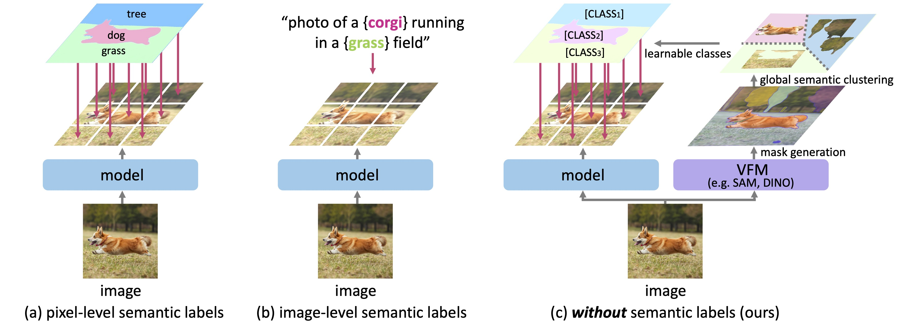

# Towards Open-Vocabulary Semantic Segmentation without Semantic Labels [NeurIPS 2024]

This is our official implementation of PixelCLIP!

[[arXiv](https://arxiv.org/abs/2409.19846)] [[Project](https://cvlab-kaist.github.io/PixelCLIP/)] <br>
by [Heeseong Shin](https://scholar.google.com/citations?user=zu-I2fYAAAAJ), [Chaehyun Kim](https://kchyun.github.io/), [Sunghwan Hong](https://sunghwanhong.github.io), [Seokju Cho](https://seokju-cho.github.io/), [Anurag Arnab](https://anuragarnab.github.io)\$$^\dagger$$, [Paul Hongsuck Seo](https://phseo.github.io)\$$^\dagger$$, [Seungryong Kim](https://cvlab.kaist.ac.kr)\$$^\dagger$$ <br>
($$^\dagger$$: Corresponding authors)

## Introduction

In contrast to existing methods utilizing (a) pixel-level semantic labels or (b) image-level semantic labels, we leverage unlabeled masks as supervision, which can be freely generated from vision founcation models such as SAM and DINO.

For further details and visualization results, please check out our [paper](https://cvlab-kaist.github.io/pixelclip/) and our [project page](https://cvlab-kaist.github.io/pixelclip/).

## Installation
Please follow [installation](INSTALL.md). 

## Data Preparation
Please follow [dataset preperation](datasets/README.md).

## Training
We provide shell scripts for training and evaluation. ```run.py``` trains the model in default configuration and evaluates the model after training. 

To train or evaluate the model in different environments, modify the given shell script and config files accordingly.

### Training script
```bash
sh run.sh [CONFIG] [NUM_GPUS] [OUTPUT_DIR] [OPTS]

# With SA-1B Masks
sh run.sh configs/pixelclip_vit_base.yaml 4 output/
# With DINO Masks
sh run.sh configs/pixelclip_vit_base.yaml 4 output/ MODEL.DINO True
```

## Evaluation
```eval.sh``` automatically evaluates the model following our evaluation protocol, with weights in the output directory if not specified.
To individually run the model in different datasets, please refer to the commands in ```eval.sh```.

### Evaluation script
```bash
sh run.sh [CONFIG] [NUM_GPUS] [OUTPUT_DIR] [OPTS]

sh eval.sh configs/pixelclip_vit_base.yaml 4 output/ MODEL.WEIGHTS path/to/weights.pth
```


## Pretrained Models
We provide pretrained weights for our models reported in the paper. All of the models were trained and evaluated with 4 NVIDIA A6000 GPUs, and can be reproduced with the evaluation script above.

<table><tbody>
<!-- START TABLE -->
<!-- TABLE HEADER -->
<th valign="bottom">Backbone</th>
<th valign="bottom">Masks</th>
<th valign="bottom">COCO-Stuff</th>
<th valign="bottom">ADE-150</th>
<th valign="bottom">Pascal-Context</th>
<th valign="bottom">CityScapes</th>
<th valign="bottom">Pascal-VOC</th>
<th valign="bottom">Download</th>
<!-- TABLE BODY -->
<!-- ROW: ViT-B/16/DINO -->
<tr>
<td align="left">CLIP ViT-B/16</a></td>
<td align="left">DINO</td>
<td align="center">22.2</td>
<td align="center">17.4</td>
<td align="center">34.3</td>
<td align="center">22.9</td>
<td align="center">83.8</td>
<td align="center"><a href="https://huggingface.co/hsshin98/PixelCLIP/resolve/main/weights/pixelclip_vit_base_dino.pth">ckpt</a>&nbsp;
</tr>
<!-- ROW: ViT-B/16/SA-1B -->
<tr>
<td align="left">CLIP ViT-B/16</a></td>
<td align="left">SA-1B</td>
<td align="center">23.6</td>
<td align="center">18.7</td>
<td align="center">37.9</td>
<td align="center">27.2</td>
<td align="center">85.9</td>
<td align="center"><a href="https://huggingface.co/hsshin98/PixelCLIP/resolve/main/weights/pixelclip_vit_base.pth">ckpt</a>&nbsp;
</tr>
<!-- ROW: ConvNeXt-B/DINO -->
<tr>
<td align="left">OpenCLIP ConvNeXt-B</a></td>
<td align="left">DINO</td>
<td align="center">20.2</td>
<td align="center">19.4</td>
<td align="center">32.7</td>
<td align="center">30.0</td>
<td align="center">62.9</td>
<td align="center"><a href="https://huggingface.co/hsshin98/PixelCLIP/resolve/main/weights/pixelclip_convnext_base_dino.pth">ckpt</a>&nbsp;
</tr>
<!-- ROW: ConvNeXt-B/SA-1B -->
<tr>
<td align="left">OpenCLIP ConvNeXt-B</a></td>
<td align="left">SA-1B</td>
<td align="center">21.4</td>
<td align="center">20.3</td>
<td align="center">35.4</td>
<td align="center">34.8</td>
<td align="center">67.2</td>
<td align="center"><a href="https://huggingface.co/hsshin98/PixelCLIP/resolve/main/weights/pixelclip_convnext_base.pth">ckpt</a>&nbsp;
</tr>
</tbody></table>


## Citing PixelCLIP

```BibTeX
@misc{shin2024openvocabularysemanticsegmentationsemantic,
      title={Towards Open-Vocabulary Semantic Segmentation Without Semantic Labels}, 
      author={Heeseong Shin and Chaehyun Kim and Sunghwan Hong and Seokju Cho and Anurag Arnab and Paul Hongsuck Seo and Seungryong Kim},
      year={2024},
      eprint={2409.19846},
      archivePrefix={arXiv},
      primaryClass={cs.CV},
      url={https://arxiv.org/abs/2409.19846}, 
}
```
